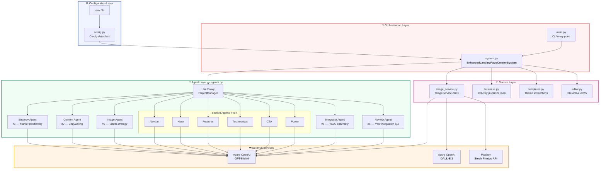
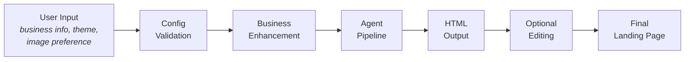

# System Architecture

## Component Overview

The system is composed of five layers — **Configuration**, **External Services**, **Agent Layer**, **Service Layer**, and **Orchestration** — that work together to transform a business description into a production-ready HTML landing page.

---

## Component Descriptions

### Configuration Layer

| Component | File | Responsibility |
|-----------|------|----------------|
| **Environment** | `.env` | Stores API keys and endpoints (git-ignored) |
| **Config** | `config.py` | Loads, validates, and exposes settings via a frozen `Config` dataclass |

### External Services

| Service | Purpose | Required? |
|---------|---------|-----------|
| **Azure OpenAI (GPT)** | Powers all 9 AutoGen agents | ✅ Yes |
| **Azure OpenAI (DALL-E 3)** | AI-generated hero images | ❌ Optional |
| **Pixabay API** | Professional stock photo fallback | ❌ Optional |

### Agent Layer

| Agent | Role | Phase |
|-------|------|-------|
| **UserProxy** | Manages agent conversations, collects responses | All |
| **Strategy Agent** | Market positioning, audience psychology, conversion strategy | 1 |
| **Content Agent** | Headlines, copy, CTAs, benefit frameworks | 1 |
| **Image Agent** | DALL-E prompts and Pixabay keywords | 2 |
| **Section Agents** (×6) | Navbar, Hero, Features, Testimonials, CTA, Footer design specs | 2 |
| **Integrator Agent** | Assembles all inputs into complete production HTML | 3 |
| **Review Agent** | Post-integration QA — validates HTML, accessibility, brand fit | 4 |

### Service Layer

| Module | Class/Functions | Responsibility |
|--------|-----------------|----------------|
| `image_service.py` | `ImageService` | DALL-E generation, Pixabay fetching, keyword extraction, fallback chains |
| `business.py` | `enhance_business_context()` | 30+ industry guidance profiles, interactive business info collection |
| `templates.py` | `get_theme_instructions()` | Light/Dark theme CSS directives, fallback HTML generator |
| `editor.py` | `LandingPageEditor` | Conversational editing loop for post-generation refinement |

### Orchestration Layer

| Module | Class | Responsibility |
|--------|-------|----------------|
| `system.py` | `EnhancedLandingPageCreatorSystem` | Wires all layers, runs the 4-phase pipeline, manages state |
| `main.py` | `main()` | CLI interface, user prompts, program flow |

---

## Data Flow

---

## Technology Stack

| Category | Technology |
|----------|-----------|
| **Language** | Python 3.10+ |
| **LLM Framework** | Microsoft AutoGen |
| **LLM Provider** | Azure OpenAI (GPT-5 Mini) |
| **Image Generation** | Azure DALL-E 3 |
| **Stock Photos** | Pixabay API |
| **Config Management** | python-dotenv |
| **HTTP Client** | requests |
| **Concurrency** | concurrent.futures (ThreadPoolExecutor) |
| **Output Format** | Single-file HTML (Tailwind CSS + Bootstrap Icons) |
