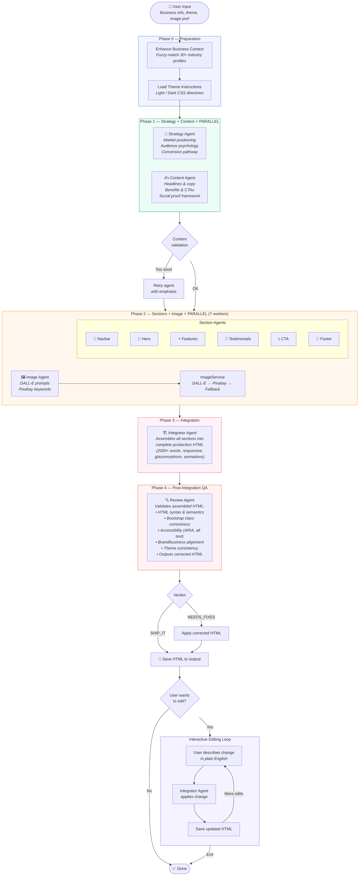
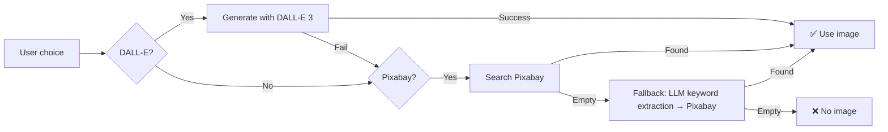
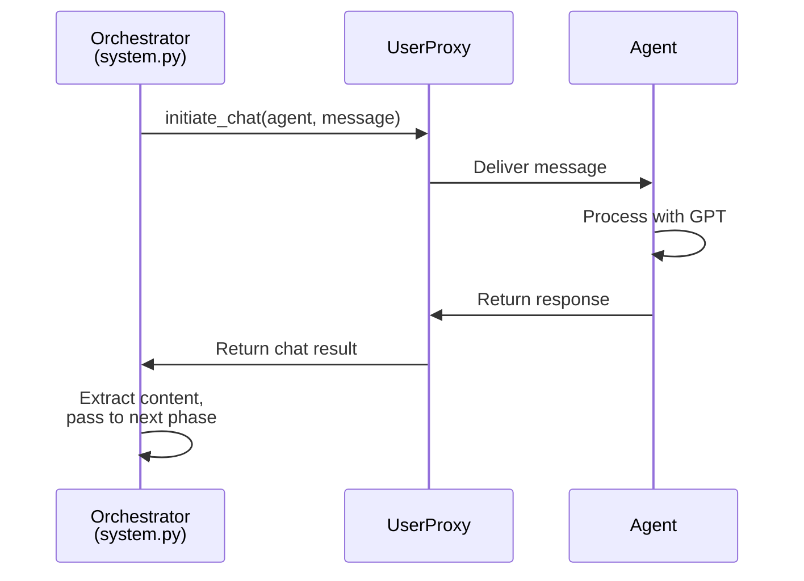

# Agent Workflow & Pipeline

## Pipeline Overview

The landing page generation follows a **4-phase pipeline** designed for maximum parallelism and quality. Each phase builds on the outputs of the previous one.

---

## Phase Details

### Phase 0 — Preparation

| Step | Module | Description |
|------|--------|-------------|
| Business Enhancement | `business.py` | Fuzzy-matches the business type against 30+ industry profiles and attaches guidance (tone, focus areas, CTA style, social proof type, urgency type) |
| Theme Loading | `templates.py` | Loads detailed CSS design directives for the chosen theme |

### Phase 1 — Strategy + Content ⚡

**Execution:** Two agents run in **parallel** via `ThreadPoolExecutor(max_workers=2)`.

| Agent | Input | Output |
|-------|-------|--------|
| **Strategy Agent** | Business context + industry guidance | Market positioning, audience psychology, conversion pathway, urgency mechanisms |
| **Content Agent** | Business context + industry guidance | Headlines, subheadlines, hero copy, 3 key benefits, social proof concepts, CTA variations |

**Validation:** If either response is < 100 characters, it is automatically retried with an emphasis prompt.

### Phase 2 — Sections + Image ⚡

**Execution:** 7 agents run in **parallel** via `ThreadPoolExecutor(max_workers=7)`.

| Agent | Output |
|-------|--------|
| **Image Agent** | DALL-E prompt + Pixabay keywords (parsed by `ImageService`) |
| **Navbar Agent** | Navigation structure description |
| **Hero Agent** | Hero section layout description |
| **Features Agent** | Features section layout description |
| **Testimonials Agent** | Testimonials section layout description |
| **CTA Agent** | Call-to-action section layout description |
| **Footer Agent** | Footer section layout description |

**Image Resolution:** After the Image Agent responds, `ImageService` attempts acquisition in this order:

### Phase 3 — Integration

The **Integrator Agent** receives:
- All section descriptions from Phase 2
- Strategy + content from Phase 1
- Hero image URL (if acquired)
- Theme instructions
- Industry guidance

It outputs a **complete, single-file HTML document** with:
- Tailwind CSS + Bootstrap Icons via CDN
- Custom CSS variables for theming
- Glassmorphism effects
- Scroll-triggered animations (Intersection Observer)
- Mobile-first responsive design
- 2000+ words of content

### Phase 4 — Post-Integration QA

> **Workflow improvement:** In the original design, the Review Agent reviewed text *descriptions* before integration — meaning it couldn't catch HTML rendering bugs, broken Bootstrap classes, or integration conflicts. Now it reviews the *assembled HTML*, providing far more valuable QA.

The **Review Agent** inspects the complete HTML and outputs:
- Critical errors list
- Section-by-section review (PASS / issues)
- Technical and business alignment scores (1-10)
- Verdict: `SHIP_IT` or `NEEDS_FIXES`
- If `NEEDS_FIXES`: a corrected HTML document

### Interactive Editing (Optional)

After generation, users can enter a conversational editing loop:

1. Describe a change in plain English (e.g., "Make the hero background gradient purple")
2. The Integrator Agent applies the change to the current HTML
3. The updated file is auto-saved
4. Repeat up to 10 times

---

## Agent Communication Pattern

All agents communicate through AutoGen's `UserProxyAgent.initiate_chat()` with `max_turns=1` (single-shot). The orchestrator (`system.py`) manages the conversation flow — agents do not talk to each other directly.

This hub-and-spoke pattern keeps agents stateless and independently testable.
